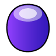
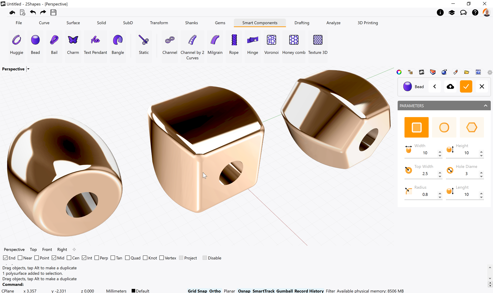
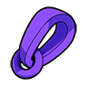
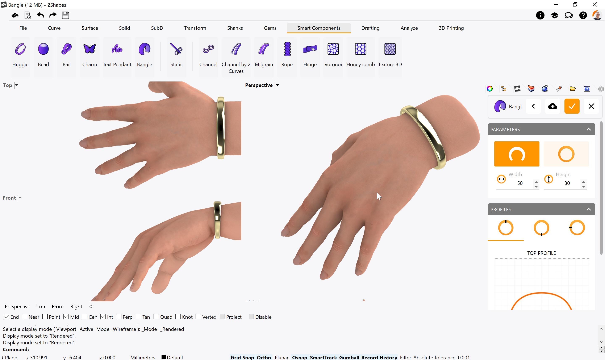
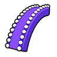
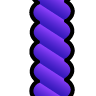
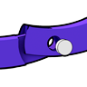
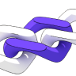
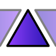
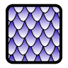

# Components

### &#x20;

<figure><figcaption></figcaption></figure>

### Bead 

With this command, you can create metal pieces ideal for wristbands and charm bracelets.

Running this command will display its parameters in the Commands toolbar. Your first step should be to choose whether you want to start working on a Standard style provided by 2Shapes, or an Organization style you have previously created.

On its parameters, you can choose either square, round, or hexagon shape, in addition, to defining its measurements with the fields below.

When you confirm your changes, the Bead will be listed on the Outliner toolbar.

### Bail 

Using this command you can create a bail piece, ideal for pendants and necklace designs.

.png>)

Running this command will display its parameters in the Commands toolbar. Your first step should be to choose whether you want to start working on a Standard style provided by 2Shapes, or an Organization style you have previously created.

On the parameters menu, you can define its shape and measurements for the top and lower sections, as well as enabling or disabling the O-ring that serves as a link to your main piece.

When you confirm your changes, the Bail will be listed on the Outliner toolbar.


Learn more about this command in [Academy](https://academy.2shapes.com/courses/2shapes-for-rhino-level-1/lesson/bail/)


### Charm 

This command allows you to create metal pieces with a dome effect, following the shape of an Asset.

.png>)

Running this command will display its parameters in the Commands toolbar. Your first step should be to choose whether you want to start working on a Standard style provided by 2Shapes, or an Organization style you have previously created.

On the parameters, you can find the shape of this charm, its measurements, and the option to its back flat or curved.

When you confirm your changes, the Charm will be listed on the Outliner toolbar.


Learn more about this command in [Academy](https://academy.2shapes.com/courses/2shapes-for-rhino-level-1/lesson/charm/)


### Bangle 

Using this command you can create a bangle element, ideal for cuff and affirmation bracelets, and other kinds of jewelry pieces.

Running this command will display its parameters in the Commands toolbar. Your first step should be to choose whether you want to start working on a Standard style provided by 2Shapes, or an Organization style you have previously created.

On the parameters, you can choose to have your bangle open or closed as well as define its size. Also, below you can find the shape, its measurements, and the option to its back flat or curved for each of its 3 sections.

When you confirm your changes, the Bangle will be listed on the Outliner toolbar.


Learn more about this command in [Academy](https://academy.2shapes.com/courses/2shapes-for-rhino-level-1/lesson/bangle/)


### Milgrain 

With this command, you can generate milgrain running down a selected curve. It's especially useful to achieve a vintage touch to any design you add this to.

.png>)

Running this command will display its parameters in the Commands toolbar.

On its parameters, you can change the diameter of each sphere, the overlapping distance in millimeters between spheres, and whether you want it to start and end in the curve's limits or at the very end.

When you confirm your changes, the Milgrain will be listed on the Outliner toolbar.


Learn more about this command in [Academy](https://academy.2shapes.com/courses/2shapes-for-rhino-level-1/lesson/milgrain/)


### Rope 

With this command, you can generate a rope pattern running down a selected curve. It's especially useful to give a creative touch to any design you add this to, or even achieve some sailor-themed style.

.png>)

Running this command will display its parameters in the Commands toolbar.

On its parameters, you can change the diameter of each thread, the whole rope width, the amount of thread, and the number of turns from start to finish. Also, if you have selected a closed curve, you can enable Infinite to make the rope seamless.

When you confirm your changes, the Rope will be listed on the Outliner toolbar.


Learn more about this command in [Academy](https://academy.2shapes.com/courses/2shapes-for-rhino-level-1/lesson/rope/)


### Hinge 

Using this command, you can generate a hinge mechanism on almost any solid object, so as to allow it to open and close. It's especially useful to make closed bracelets and other pieces that require this motion.

Running this command will display its parameters in the Commands toolbar.

On its parameters, you can find the selection square that allows you to choose which object you want to make the hinge on, and then select the point where to generate the hinge. Below, you can find the various measurements, the number of male inserts, the opening angle, the direction it opens, and also an option to flip the direction is facing currently.


Learn more about this command in [Academy](https://academy.2shapes.com/courses/2shapes-for-rhino-level-1/lesson/hinge-2/)


### Link 

The chain link command allows us to precisely design a slab to our taste and style. Defining measure, rotations, and analysing how they behave with the front and rear links... Also, it allows us to create cuban Link in seconds analyzing the weight in real time in each modification.

<figure><figcaption></figcaption></figure>

### Chain 

The chain command allows us to select a chain link and copy it by a curve, being able to change parameters such as rotations, copies, ... This can be very useful for calculating the necessary links in a chain, even for chain rendering.

<figure><figcaption></figcaption></figure>

### Pattern 

This command allows you to select an object and replicate it the number of rows and columns you want. It's ideal for quickly creating a large array of the same object, generating rich, beautiful patterns.

Running this command will display its parameters in the Commands toolbar.

On its parameters, you can find two selection squares: the left one allows you to choose which object you want to replicate, and the right one allows you to select a surface to fill with the pattern. Below you can find fields to define the number of rows and columns to generate, the margins to leave at each face, their rotation, an option to reverse their orientation, the distance in millimeters above or below the original surface, and their maximum thickness.


Learn more about this command in [Academy](https://academy.2shapes.com/courses/2shapes-for-rhino-level-1/lesson/pattern/)


### Voronoi 

With this command, you can select a closed curve, and 2Shapes will fill it with a random and unique Voronoi pattern. It's especially useful for filling up hollowed designs and creating gorgeous organic-like patterns.

.png>)

Running this command will display its parameters in the Commands toolbar.

After running this command, you can select the closed curve you want to use by clicking on the selection square. Below you can find the parameters such as the branching's thickness, its height, and all its measurements.


You can click on the Refresh button anytime to generate a new random pattern. Note that you can't recover the previous pattern.


When you confirm your changes, if the Voronoi object has some height, it will be listed on the Outliner toolbar.

### Honeycomb 

With this command, you can select a closed curve, and 2Shapes will fill it with a Honeycomb pattern. It's especially useful for filling up hollowed designs and creating gorgeous geometric patterns.

.png>)

Running this command will display its parameters in the Commands toolbar.

After running this command, you can select the closed curve you want to use by clicking on the selection square. Below you can find the parameters such as the honeycomb thickness, its height, and all its measurements.

When you confirm your changes, if the Honeycomb object has some height, it will be listed on the Outliner toolbar.

### Texture 3D 


This is a resource-intensive command that requires your computer to make heavy processing. We suggest only using this command when other programs on your device are closed.


Using this command you can select a surface, and cover it with an amazing Texture 3D, a three-dimensional interpretation of a 2D texture using it as a heightmap. It's especially useful to apply complex texturing to your designs.

 - Microsoft Visual Studio.png>)

Running this command will display its parameters in the Commands toolbar.

You can choose which texture you want to use by clicking on the left selection square, this will open your available textures. With the right selection square, you can choose which object you want to apply the Texture 3D to. Below you can find the measurements of the texture, from its stretching in U and V, its displacement, height, and rotation. You also have the option to align the texture in its four corners or mirror it on two axes. At the bottom, you can find the Resolution slider, which lets you adjust the quality of the resulting texture.

To create the Texture 3D, click on the Refresh button. Once the preview is being displayed, you can click on the Confirm changes button.

When you confirm your changes, the Texture 3D will be listed on the Outliner toolbar.


You can add more textures by placing them on your [User Folder](broken-reference) > Textures3D

Learn more about this command in [Academy](https://academy.2shapes.com/courses/2shapes-for-rhino-level-1/lesson/texture-3d-2/)

