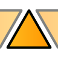

# Curve

<figure><figcaption></figcaption></figure>

### Assets

Upon running this command, the Assets Manager window will open.

Here you can find all the Assets you have in your organization. The first row of icons represent the Asset type, and the second row separates Standard Assets provided to you by 2Shapes, and Organization Assets, which are the ones you have created and saved so far.

.png>)

Asset types (from left to right):

* **Ring curves**: These are used to give revolving shape to Classic, Cathedral, and Advanced shanks.
* **External ring curves**: Can be used on Classic shanks to affect the outer shape of your design, replacing the default fully circular form.
* **Signet ring curves**: These shapes allow you to change the seal shape on your signet ring.
* **Channel curves**: These are used primarily to define the revolving shape of your Halo gemset channel.
* **Prong curves**: With this profile, you can change the shape for prongs on Basket and Halo gemsets.
* **Charm curves**: Using this curve you can create a 3D object with a bombé finish, ideal for the creation of charms and pendants.
* **Bezel curves**: These curves are used exclusively to give a revolving shape to Bezel gemsets.
* **Peg head curves**: These curves are used exclusively to give a shape to the Peg head gemset's prongs.

At the lower-right corner of this menu you can from left to right, a button to create a new asset of the category you are in, and a button to accept your changes.

If you have selected an Asset, you will have some extra buttons:

* If you have selected a Standard Asset:
  * **Copy to my library**: Duplicates this asset to your Organization section, where you will be able to interact with it.

* If you have selected an Organization Asset:
  * **Edit**: Opens the selection on the Asset Editor and allows you to manipulate it.
  * **Rename:** Opens a window that displays the current name of the Asset, and allows you to change it by typing in the new name.
  * **Duplicate**: Makes a copy of the selected Asset.
  * **Delete**: Deletes the selected Asset. To recover it, you will need access to 2Shapes Design.

.png>)

### Advanced Curve

With this command you can create a complex curve through some steps:

1\) Once you run the command, it will ask you to pick a point where the curve will start.

2\) Click on any other place to create a new point for your curve.

3\) When you press the Escape or Enter key, or if you right-click on the viewport, the command will end and stop adding more points to your curve.

.png>)

When running the command, you can see three options in the command prompt:

* **Close**: If it's set to On, it will generate a closed curve with ends meeting the starting point.
* **Symmetry**: Disabled by default, it can be set to X if you want horizontal symmetry, to Y to make it vertically symmetric, or Quad, if you wish to make the curve symmetric on all axis.
* **Offset**: Clicking on this option allows you to type the thickness of this curve in millimeters.
* **Undo**: If clicked, it will undo the previous change you made.


Learn more about this command in [Academy](https://academy.2shapes.com/courses/2shapes-for-rhino-level-1/lesson/advanced-curve/)


### Waves

Using this command, you can create a wavy curve following another curve as a reference.

.png>)

Once you run Waves, you will see two options on the command prompt:

* **Height**: If clicked, it will allow you to type in the maximum displacement from the center of the selected curve in millimeters.
* **Waves**: If you click on this option, it will allow you to type in the number of waves you want to fit in the selected curve.

Pressing the Enter key will create the Waves curve. If you press the Escape key or right-click on your viewport the command will stop and cancel your changes.


Learn more about this command in [Academy](https://academy.2shapes.com/courses/2shapes-for-rhino-level-1/lesson/waves/)


### Pattern

With this command, you can create multiple copies of an object and arrange them parametrically.

Once you run Pattern, all its parameters will be shown on the Commands toolbar:

* **Object Selector**: Clicking this left square allows you to select the object you want to use for the pattern.
* **Surface Selector**: By clicking this right square, you can select a surface, to which the pattern will be oriented.
* **Column**: The number of column reiterations that will be generated.
* **Rows**: The number of rows your object will be repeated.
* **X Padding**: The margin between columns in millimeters.
* **Y Padding**: The margin between rows in millimeters.
* **X Rotation**: It's the amount of horizontal rotation in degrees you want to apply to your pattern.
* **Y Rotation**: It's the amount of vertical rotation in degrees you want your pattern to have.
* **Reverse Mode**: Needs a selected surface. Has three options, None, to disable it, Reverse X, to invert the horizontal orientation on the selected surface, Reverse Y, to invert the vertical orientation, and Both, to invert the orientation in the X and Y axes.
* **Move on Z**: The vertical distance above the surface where the pattern is being generated.
* **Enable Max Thickness**: Activates the maximum thickness.
* **Max Thickness**: Only applies if Enable Max Thickness is enabled. Sets the maximum extent in millimeters the pattern will not exceed.


Learn more about this command in [Academy](https://academy.2shapes.com/courses/2shapes-for-rhino-level-1/lesson/pattern/)


### Raster to Vector

This command allows you to convert an image into a group of curves. It's especially useful to translate images into 3D models.

When running the command, its parameters will be displayed on the Commands toolbar.


Learn more about this command in [Academy](https://academy.2shapes.com/courses/2shapes-for-rhino-level-1/lesson/raster-to-vector/)


### Text on Curve

With this command, you can create Text made out of curves, and make it follow any curve as a rail.

If you run this command, all its parameters will be accessible via the Commands toolbar.


Learn more about this command in [Academy](https://academy.2shapes.com/courses/2shapes-for-rhino-level-1/lesson/text-on-curve/)


### Auto Join

Autojoin automatically unites all the curves in your file that meet at a common end, making single curves.


Learn more about this command in [Academy](https://academy.2shapes.com/courses/2shapes-for-rhino-level-1/lesson/join-and-autojoin/)


### Curves On 1 Rail

The "Orient on 1 rail" command in 2Shapes for Rhino is used to move and rotate curves along another curve called the rail. It utilizes the direction of the rail curve to determine the orientation of the curves being moved. This command offers several modes:

**Open**: This mode creates an open curve.

**Close**: This mode creates a closed curve.

**Comfort**: This mode creates a smooth closed curve.

**Thickness**: This mode creates a closed curve by offsetting it from the main curve.


To better understand the command, please visit [Academy](https://academy.2shapes.com/courses/2shapes-for-rhino-level-2/lesson/orient-on-1-rail/).


### Curves On 2 Rails

The "Orient on 2 Rails" command in 2Shapes for Rhino uses two curves called "rails" to orientate a third curve. It utilizes the direction of the rails for orientation. This command offers several modes, such as:

**Keep Proportion:** Maintains the proportion of the curve or adapts it to the rails.

**Mode:** Sets the way the curve will be closed.

**Sweep:** Makes the curve follow the rails or only orientate itself.

**Thickness:** Sets the thickness measurements.
