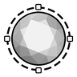
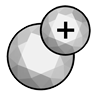
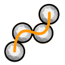
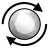
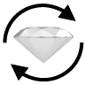

# Diamonds

###

<figure><figcaption></figcaption></figure>

### Gem Studio

Using this command you can create your own stone, without having to bring it from your inventory.

.png>)

Running this command will display its parameters in the Commands toolbar.

Once the command is executed, you can create your stone in three ways:

* **Left selection square**: This will generate your stone at the center of the CPlane.
* **Center selection square**: With this option, you will generate the stone where you left-click. Hovering your mouse over a valid placement will display a preview. To finish placing stones you must right-click on your viewport.
* **Right selection square**: Allows you to select a base object and left-click on the object to place stones oriented on it. To finish placing stones you must right-click on your viewport.

You can select which shape, the specimen of stone, and its measurements with the Parameters menu.

Once you confirm your changes, all the stones you have generated will be listed on the Outliner toolbar.


Learn more about this command in [Academy](https://academy.2shapes.com/courses/2shapes-for-rhino-level-1/lesson/gems-creator/)


### Gems by Curve

With this command, you can parametrically add gems to any curve. This is especially useful when adding gems to organic designs, and complex pieces that follow curves.

Running this command will display its parameters in the Commands toolbar.

If you run this command, you will be able to select a curve where to add the stones with the left selection square, and select an object with the right selection square for your gems to be oriented to.

Below, you can find the Parameters menu with the stones you want to add and multiple options beneath. On the table, you can type in the quantity of stones, its size in carats, their shape, and the rotation. To add a different array of gems, type in your parameters on the next row.


You can drag the gumballs displayed on your viewport, to define where you want to start and finish placing gems along the curve.


Once you confirm your changes, all the stones you have generated will be listed on the Outliner toolbar.


Learn more about this command in [Academy](https://academy.2shapes.com/courses/2shapes-for-rhino-level-1/lesson/gems-by-curve/)


### Gems by 2 Curves

With this command, you can parametrically generate gems between 2 curves. This is especially useful when you want to fill spaces with gems on organic designs, and other complex pieces.

.png>)

Running this command will display its parameters in the Commands toolbar.

If you run this command, you will be able to select the two curves where the gems will be generated with the selection square.

You can set the type of gem you want to generate, the distance between them, the displacement above the curves, and if you want to flip their orientation and force a precise calculation with the Parameters menu.

Once you confirm your changes, all the stones you have generated will be listed on the Outliner toolbar.


Learn more about this command in [Academy](https://academy.2shapes.com/courses/2shapes-for-rhino-level-1/lesson/gems-by-2-curves-2/)


### Gems by Network

With this command, you can parametrically generate gems on any curve, and on multiple curves at once, 2Shapes will place diamonds where curves intersect. This is especially useful when adding gems to organic designs, and complex pieces that follow curves.

Running this command will display its parameters in the Commands toolbar.

If you run this command, you will be able to select the curves where the stones will be generated with the left selection square, and select an object with the right selection square for your gems to be oriented to.

You can set the type of gem you want to generate, the distance between them, the displacement above the curves.

Aditionally you can also switch from displaying gems or just their perimeter, and show a tag with their carat value on each gem.


If you click on a carat tag on a gem, you will be able to change that gem's size independantly from the others. These carat tags will be generated on gems place on intersections between curves.


Once you confirm your changes, all the stones you have generated will be listed on the Outliner toolbar.


Learn more about this command in [Academy](https://academy.2shapes.com/courses/2shapes-for-rhino-level-1/lesson/gems-by-network/)


### Pearl 

With this command you can create pearls with the size you want. You can also generate calotte and wires to match.

.png>)

Running this command will display its parameters in the Commands toolbar.

A part from defining its size in millimeters, you can also decide where you want to create a pearl wire and a calotte, ech with their own parameters.

Once you confirm your changes, the pearl you have created will be listed on the Outliner toolbar.


The Pearl Wire and Calotte are generated as two individual objects independent from one another and their pearl. You can pair them using the Group command.

Learn more about this command in [Academy](https://academy.2shapes.com/courses/2shapes-for-rhino-level-1/lesson/pearl/)


### ​Cabochon 

With this command, you can create cabochons in multiple shapes, finishes, and sizes.

.png>)

Running this command will display its parameters in the Commands toolbar.

You can define its shape; be it round, oval, rectangular, among others, as well as its finish; standard cabochon, buff top double bevel, among many. Also, you can set its measurements in millimeters, and the different angles in degrees.

Once you confirm your changes, the cabochon you have created will be listed on the Outliner toolbar.


Learn more about this command in [Academy](https://academy.2shapes.com/courses/2shapes-for-rhino-level-1/lesson/cabochon/)


### Gems Center

This command is used to create points precisely in the center of a gem, at the height of its girdle.

If you run this command, it will ask you to select the diamonds or gemstones you want to use to create points. After selecting them, if you press the Enter key the command will generate the points. If you press the Escape key the command will end without generating points.

### Gems Offset

With this command, you can create a circular curve around diamonds and gemstones, especially useful when creating custom gem settings.

When you run this command, it will ask you to select which gems you want to use to generate the curves. You can change the extra diameter by clicking on the number on the command prompt. If you press the Enter key, the curves will be created.

### Copy by Gems

Currently, this command is under construction and will be released on future updates. Keep an eye on our social networks, blog, and community to know when it comes out.

### Gems Move

Using this command, you can move gems precisely the distance you type in.

After running this command, you will be asked to select the gem you want to move, and later how much distance in millimeters you want to move it.

### ​Curve by Gems 

With this command, you can create a curve following the center of multiple stones. It's especially useful to generate custom geometry for your designs around its gems.

When running the command, it will ask you to select the stones where you want the curve to pass through. The order in which you select the gems will define the trajectory of the curve. Once finished, you can press the Enter key to generate the curve.

### ​Rotate Gems - Left or Right 

Using this command, you can horizontally rotate one or multiple gems at once on their individual axis.

Once you run this command, it will ask you to select the gems you want to rotate, once selected, you can click on the number in the command prompt to type the angle in degrees you want your gems to be rotated. Pressing the Enter key finishes the rotation.

### ​Flip 

With this command, you can vertically flip one or multiple selected gems on their individual axis.

Once you run this command, it will ask you to select the gems you want to flip, once selected, you can click on the number in the command prompt to type the angle in degrees you want your gems to be flipped. Pressing the Enter key finishes the rotation.

### ​Recover 

Using this command, 2Shapes will recognize gems in your design made without 2Shapes tools and transform them into 2Shapes gems, so you can use gem settings and other features on them. It's especially useful when trying to convert a model made with another software into a 2Shapes design.

After running the command, 2Shapes will automatically recognize all gems in your model and will transform them into 2Shapes gems.

