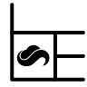

# Drafting

<figure><figcaption></figcaption></figure>

### Report

With this command, you can create a full Report sheet containing four viewports, its name, and other details.

.png>)

After running this command, a new Layout will be created with 4 viewports arranged to fit the squares on your new Report sheet. You can double-click on any of these viewports to change its visualization mode, angle, and zoom.

All texts can be edited by double-clicking on them. You can use your own logo instead of the default 2Shapes one shown on the lower-left corner by using the Add logo command.


We suggest using the Text command on the Curve tab.

Learn more about this command in [Academy](https://academy.2shapes.com/courses/2shapes-for-rhino-level-1/lesson/report-2/)


### Gems Map

Using this command, you can generate a graphic representation in 2D of the gems of your design, their placement, and their weight in carats.

.png>)

Once you have run this command, you will be asked to pick a point on your scene where the Gems Map will be generated.

After being created, you can scale and move the Gems Map using the Gumball.


Learn more about this command in [Academy](https://academy.2shapes.com/courses/2shapes-for-rhino-level-1/lesson/gems-map/)


### Gems List

With this command, you can create a list of the gems, their shape, dimensions, total weight in carats, amount, and their individual weight also in carats.

.png>)

Once you have run this command, you will be asked to pick a point on your scene where the Gems List will be generated.

After being created, you can scale and move the Gems List using the Gumball. You can also edit the text by double-clicking on it.

### Add Logo

With this command, you can define one or multiple objects as your brand's logo.

Once you have run this command, you will be asked to select which objects you want to use as a logo. These objects will be saved in your User Folder.


We suggest using the Open command on the File tab, to add your own logo in vector format.

