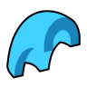
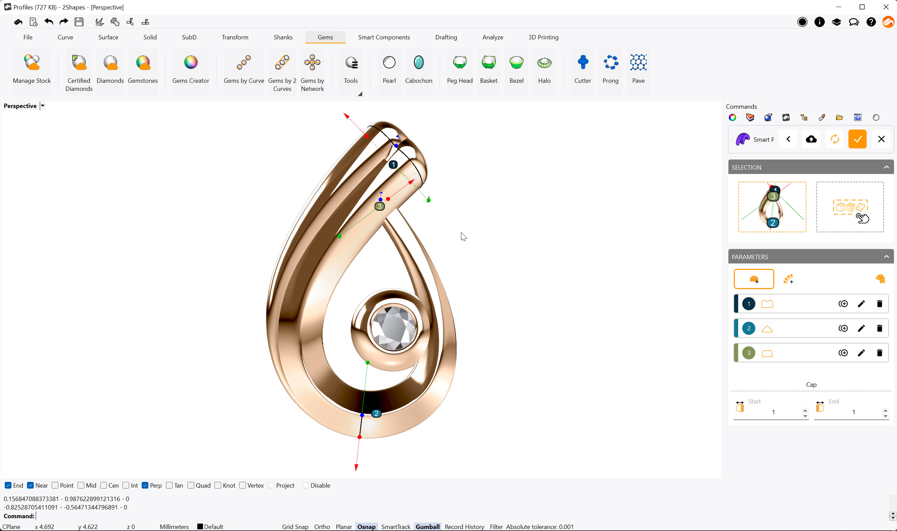
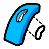

# Solid

<figure><figcaption></figcaption></figure>

### Profiles 

Using this command you can create a custom Element following a curve, and use multiple shapes on multiple points along the curve. Ideal to make decorative elements, or sleek and amazing jewelry pieces.

When you run this command, it will ask you to select the curve you want to work with.

Running this command will display its parameters in the Commands toolbar. Your first step should be to choose whether you want to start working on a Standard style provided by 2Shapes, or an Organization style you have previously created.

After running the command, you can choose the curve you want to use with the left selection square, and optionally an object for your piece to be oriented to with the right selection square. Below, you can find the icons to add profiles one by one, or multiple automatically. You can also hide or show the geometry being generated with the right-most icon.

All profiles created will be listed on the Parameters menu. To their right you will find three icons; to duplicate, edit, or delete that profile. Additionally, you can move, rotate, and change the profile measurements using the gumballs on your viewport.


You will need to have at least 2 profiles created in order to generate valid geometry.


When you confirm your changes, the Profile object will be listed on the Outliner toolbar.


Learn more about this command in [Academy](https://academy.2shapes.com/courses/2shapes-for-rhino-level-1/lesson/profiles/)


### Curve Shell

With this command, you can select closed curves, and generate a shell-shaped solid, with a flat platform and vertical walls. This is especially useful to create solid surfaces where to set gems or Texture 3D.

.png>)

When running this command, its parameters will be shown on the Commands toolbar.

Clicking the selection square will allow you to select the closed curve you want to use to create the Curve Shell object.

Once you confirm your changes, the Curve Shell object will be listed on the Outliner toolbar.


Learn more about this command in [Academy](https://academy.2shapes.com/courses/2shapes-for-rhino-level-2/lesson/curve-shell-2/)


### Cap Round

Using this command allows you to create dome-shaped enclosures following the form of a closed curve.

.png>)

Running this command will display its parameters in the Commands toolbar.

By clicking the selection square, you can select the curve you would like to use to generate the Cap Round object.

Once you confirm your changes, the Cap Round object will be listed on the Outliner toolbar.


Learn more about this command in [Academy](https://academy.2shapes.com/courses/2shapes-for-rhino-level-1/lesson/round-cap/)


### Recess

This command allows you to create depressions or protrusions on solid objects following the shape of a curve, which should be in contact with the solid.

.png>)

When you run the command, its options will be displayed on the command prompt. It will first ask to select the curve, and then the solid object. Following will give you two parameters Height, which is the dimensions in millimeters of the recess or protrusion, and Mode, which can be Recess to make a depression in the object, or Protrusion to make a bump.

Pressing the Enter key confirms your changes and finishes the command.


Learn more about this command in [Academy](https://academy.2shapes.com/courses/2shapes-for-rhino-level-1/lesson/recess/)


### Cut

With this command you can make a hole on a solid object. It's especially useful to punch holes into your designs using the shape you want.

If you run this command, it will ask you to select the planar curve you want to use as the shape, and then a solid object which you want to make the hole into.


To take effect, the selected planar curve should be oriented with its inner area towards the solid object.



Learn more about this command in [Academy](https://academy.2shapes.com/courses/2shapes-for-rhino-level-2/lesson/cut-2/)

