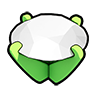
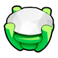
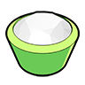
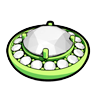
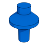
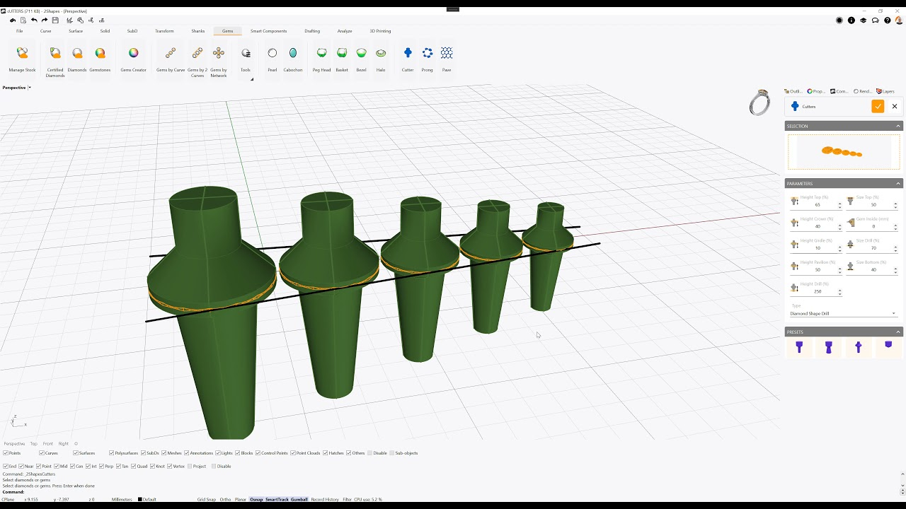
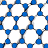
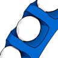

# Stone Settings

<figure><figcaption></figcaption></figure>

### Peghead

This command allows you to set a selected gem into a Peghead configuration.

.png>)

Running this command will display its parameters in the Commands toolbar. Your first step should be to choose whether you want to start working on a Standard style provided by 2Shapes, or an Organization style you have previously created.

On its parameters, you can find the prong configuration as well as their thickness, the height over the gem's girdle, the whole peg head height, the width of prongs next to the girdle, and the overlapping distance inside the gem.

When you confirm your changes, the Peghead will be listed on the Outliner toolbar.


Learn more about this command in [Academy](https://academy.2shapes.com/courses/2shapes-for-rhino-level-1/lesson/peghead-builder/)


### Basket

This command allows you to set a selected gem into a Basket configuration.

.png>)

Running this command will display its parameters in the Commands toolbar. Your first step should be to choose whether you want to start working on a Standard style provided by 2Shapes, or an Organization style you have previously created.

On its parameters, you can find the prong configuration as well as their diameter, the height over the gem's girdle, the whole basket height, among others. Also, you can click on the Rails tab to see the parameters for the lower and upper rails.

When you confirm your changes, the Basket will be listed on the Outliner toolbar.


Learn more about this command in [Academy](https://academy.2shapes.com/courses/2shapes-for-rhino-level-1/lesson/basket-builder/)


### Bezel

This command allows you to set a selected gem into a Bezel configuration.

.png>)

Running this command will display its parameters in the Commands toolbar. Your first step should be to choose whether you want to start working on a Standard style provided by 2Shapes, or an Organization style you have previously created.

On its parameters, you can find its measurements such as its diameter, the height over the gem's girdle, and the whole bezel height, among others. Below you can set Galleries, which are punch holes that go through the interior of the bezel, and Cutters, which tend to be at the top or bottom, cutting the rim.

When you confirm your changes, the Bezel will be listed on the Outliner toolbar.


Learn more about this command in [Academy](https://academy.2shapes.com/courses/2shapes-for-rhino-level-1/lesson/bezel-builder/)


### Halo

This command allows you to set a selected gem into a Halo configuration. You don't need to select the small diamonds surrounding the main gem to run this command.

.png>)

Running this command will display its parameters in the Commands toolbar. Your first step should be to choose whether you want to start working on a Standard style provided by 2Shapes, or an Organization style you have previously created.

On its parameters, you can find the measurements for the halo. From left to right; the first tab contains the measurements for the metal channel around the main stone, the second tab has the measurements for the channel's gems, and the third tab contains the parameters for the main gem's prongs.

When you confirm your changes, the Halo will be listed on the Outliner toolbar.


Learn more about this command in [Academy](https://academy.2shapes.com/courses/2shapes-for-rhino-level-1/lesson/halo/)


### Cutter

With this command, you can intuitively create cutters on selected gems to later make a Boolean Difference and make the holes through an object. It's especially useful to set stones on flush settings or complex designs.

Running this command will display its parameters in the Commands toolbar. To select the gems you want to have cutters, click on the selection square on top of the menu, and then click on the gems. Here you can find the measurements of the different parts of the cutters. You can also choose one of the presets at the bottom.

To select the gems you want to have cutters, click on the selection square on top of the menu, and then click on the gems.

When you confirm your changes, the Cutters will be listed on the Outliner toolbar.


Learn more about this command in [Academy](https://academy.2shapes.com/courses/2shapes-for-rhino-level-1/lesson/cutters/)


### Prongs

With this command, you can place prongs freely with your mouse, with precision and flexibility. It's especially useful when setting stones on organic or other complex designs.

Running this command will display its parameters in the Commands toolbar. Your first step should be to select the object you want to add prongs to by clicking on the selection square. There are three squares corresponding to three different modes, from left to right:

* **Create mode**: With it, you can click and generate new prongs using the parameters on the menu below. Hovering your mouse over a valid placement will display a preview of the prong.
* **Delete mode**: With this, you can click on prongs you have created with this command before confirming your changes, and remove them. Hovering your mouse over a valid prong will highlight it in yellow.
* **Move mode**: Once clicked, you can select a prong that will be removed from its current location, and if you click again on another location, it will be added there. Hovering your mouse over a valid prong will highlight it in yellow, and hovering your mouse over a valid placement will display a preview of the prong.

On the Parameters menu, you can set the various measurements for the prongs you generate with this command.

Additionally, on the Advanced menu, you can see various optional features, from left to right:

* **Enable Shortcuts**: Disabled by default. It allows you to press certain keys to quickly perform actions. These keys are displayed on the left side of your viewport.
* **Swap Display Mode**: Disabled by default. If enabled prongs will be represented as 2D circles at their base.
* **Show Gem Sizes**: Enabled by default. Shows a bubble with the diameter in millimeters on all prongs.
* **Undo**: If clicked, the previous action will be undone.
* **Symmetry**: Set to None by default. It allows you to place multiple prongs precisely on a mirrored position on various axis.

When you confirm your changes, the Prongs will be grouped together and listed on the Outliner toolbar.

### ​Pave 

With this command, you can place gems freely with your mouse, with precision and flexibility. It's especially useful when setting stones on organic or other complex designs.

.jpg>)

Running this command will display its parameters in the Commands toolbar. Your first step should be to select the object you want to add gems to by clicking on the selection square. There are three squares corresponding to three different modes, from left to right:

* **Create mode**: With it, you can click and generate new gems using the parameters on the menu below. Hovering your mouse over a valid placement will display a preview of the gem and its minimum distance.
* **Delete mode**: With this, you can click on gems you have created with this command before confirming your changes, and remove them. Hovering your mouse over a valid gem will highlight it in yellow.
* **Move mode**: Once clicked, you can select a gem that will be removed from its current location, and if you drag on another location, it will be added there. Hovering your mouse over a valid gem will highlight it in yellow.

On the Parameters menu, you can set the various measurements for the prongs you generate with this command.

Additionally, on the Advanced menu, you can see various optional features, from left to right:

* **Enable Shortcuts**: Disabled by default. It allows you to press certain keys to quickly perform actions. These keys are displayed on the left side of your viewport.
* **Swap Display Mode**: Disabled by default. If enabled gems will be represented as 2D circles at their base.
* **Show Gem Sizes**: Enabled by default. Shows a bubble with the diameter in millimeters on all gems.
* **Undo**: If clicked, the previous action will be undone.
* **Symmetry**: Set to None by default. It allows you to place multiple gems precisely in a mirrored position on various axis.

When you confirm your changes, the Gems will be grouped together and listed on the Outliner toolbar.


Learn more about this command in [Academy](https://academy.2shapes.com/courses/2shapes-for-rhino-level-1/lesson/pave/)


### ​Micro Setting 

With this command, you can intuitively create a micro setting on selected gems to later make a Boolean Difference and make the gaps through an object. It's especially useful to create very traditional pieces and set stones on complex designs.

<figure><figcaption></figcaption></figure>

Running this command will display its parameters in the Commands toolbar. To select the gems you want to have micro setting, click on the selection square on top of the menu, and then click on the gems. Clicking on the Rotate Orientation icon at the lower-right corner, to change the orientation of the microsetting.

Additionally, using the three icons below you can also enable the following, from left to right:

* **Cutters**: Creates a cutter that is used to make a gap that will go from each gem towards its sides.
* **V Prongs**: Creates a cutter that is used to make a gap between the cutters described above.
* **V Channel**: Creates a cutter that follows the gems path, it's used to create a gap in the shape of a channel across all gems.
* **Prongs in a Row**: Creates prongs between the select gems. Used to set gems following their direction and angle.

For each cutter you have enabled, a menu will appear below with its parameters, so you can set their configuration and measurements.

To select the gems you want to have cutters, click on the selection square on top of the menu, and then click on the gems.
