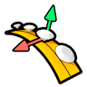
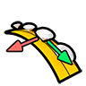
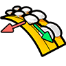
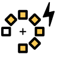
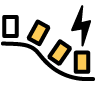
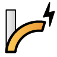
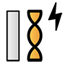

# Transform

<figure><figcaption></figcaption></figure>

### Move by Normal

You can find this command by expanding the Move submenu.

Using this command, you can move one or more objects closer or further from a surface, following its orientation. It's especially useful to move multiple related objects with exact precision.

Upon running this command, it will ask you to select the object you want to move, and the surface you want to take as reference. You can then change the Height, the parameter that defines the distance in millimeters the objects will travel.


If you enter a positive number in Height, it will increase the distance between the objects and the surface. Typing in a negative value will instead pull closer the objects to the surface.


Pressing the Enter key confirms your changes and finishes the command.

### Move on Objects

You can find this command by expanding the Move submenu.

This command allows you to move an object to place it on another object following its orientation while retaining its original distance. It's especially useful when adding fine details to your designs.

When running this command, it will ask you to select the object you want to move, and then the base object will use as a reference. After that, you will be able to click on the point where you want to place the object. If you are hovering your mouse over a valid area, a preview of the object will be visible where it will be placed.


We suggest making sure the object you will move is on the angle and distance you want to be placed in relation to the base object before running this command.


### ​Move Random 

You can find this command by expanding the Move submenu.

This command allows you to move one or multiple objects randomly both in vertical and horizontal directions.

When running this command, it will ask you to select the objects you want to move, you can then click on the distance value to set how many millimeters you want the objects to be moved from their original positions. After pressing the Enter key, the command will finish.

### Copy on Objects

You can find this command by expanding the Copy submenu.

This command allows you to copy an object, and place its duplicates on another object following its orientation while retaining their original distance. It's especially useful when adding fine details to your designs.

When running this command, it will ask you to select the object you want to copy, and then the base object it will use as a reference. After that, you will be able to click on points where the duplicates will be placed. If you are hovering your mouse over a valid area, a preview of the copy will be visible where it will be placed.


We suggest making sure the original object you will copy it's on the angle and distance you want your copies to be placed in relation to the base object before running this command.


To exit the command, press the Enter or Escape keys.

### Mirror Quad

This command makes exact copies of an object following the original's position on the CPlane and mirrors them in 90º, 180º, and 270º. It's very useful when you want to create mirrored duplicates symmetrically with maximum precision.

When running this command, it will ask you to select the object you want to copy. When you press the Enter key, the command will generate the mirrored copies and end.


Learn more about this command in [Academy](https://academy.2shapes.com/courses/2shapes-for-rhino-level-1/lesson/mirror-and-mirror-quad/)


### Center

This command places a selected object in the origin of the CPlane, so the object's 3D center matches the center of the CPlane. It's especially useful to reset transformations and relocate objects.

After running this command, it will ask you to select which object you want to move to the origin of the CPlane, once selected, if you press the Enter key, it will be moved to the center of the CPlane, finishing the command.


Learn more about this command in [Academy](https://academy.2shapes.com/courses/2shapes-for-rhino-level-1/lesson/center/)


### Orient On 1 Rail

The "Orient on 1 rail" command in 2Shapes for Rhino is used to move and rotate curves along another curve called the rail. It utilizes the direction of the rail curve to determine the orientation of the curves being moved. This command offers several modes:

**Open**: This mode creates an open curve.

**Close**: This mode creates a closed curve.

**Comfort**: This mode creates a smooth closed curve.

**Thickness**: This mode creates a closed curve by offsetting it from the main curve.


To better understand the command, please visit [Academy](https://academy.2shapes.com/courses/2shapes-for-rhino-level-2/lesson/orient-on-1-rail/).


### Orient On 2 Rails

The "Orient on 2 Rails" command in 2Shapes for Rhino uses two curves called "rails" to orientate a third curve. It utilizes the direction of the rails for orientation. This command offers several modes, such as:

**Keep Proportion:** Maintains the proportion of the curve or adapts it to the rails.

**Mode:** Sets the way the curve will be closed.

**Sweep:** Makes the curve follow the rails or only orientate itself.

**Thickness:** Sets the thickness measurements.

### Quick Orient on Surface

This command allows you to place a copy of an object on a base object, matching the orientation of the base one.

When you run this command, you will be asked to select the base object used as a reference, and then the object you want to place and orient. Then, if you hover your mouse over the base object, a preview of the copy will be displayed. If you click left-click on the base object, you will place a copy there.


On the left side of your screen, you will see some shortcuts to manipulate the copies you place on the base object.

Learn more about this command in [Academy](https://academy.2shapes.com/courses/2shapes-for-rhino-level-2/lesson/quick-orient-on-surface-2/)


### Quick Array Polar

This command allows you to create multiple copies of an object in a circular pattern.

.png>)

Running this command will display its parameters in the Commands toolbar.

When running the command, click on the selection square to pick what object you want to copy. You can then set the number of copies, what angle to fill with those, and many other parameters with the menu below.


Learn more about this command in [Academy](https://academy.2shapes.com/courses/2shapes-for-rhino-level-1/lesson/quick-array-polar/)


### Quick Array on Curve

This command allows you to create multiple copies of an object following the orientation of a curve.

Running this command will display its parameters in the Commands toolbar.

When running this command, click on the left selection square to pick what object you want to copy, the center selection square to select the curve it will follow, and optionally the right square to choose an object they will be oriented to. You can then set the number of copies, the distance between them, and other parameters with the menu below.


Learn more about this command in [Academy](https://academy.2shapes.com/courses/2shapes-for-rhino-level-1/lesson/quick-array-on-curve/)


### ​Scale by Weight 

With this command, you can grow or shrink an object based on the goal weight.

Running this command will display its parameters in the Commands toolbar.

When running this command, click on the selection square to pick the object you want to scale. Then, type the desired result in the Weight in Grams parameter. You can also choose to delete the original object by switching on the option on its right.


Learn more about this command in [Academy](https://academy.2shapes.com/courses/2shapes-for-rhino-level-1/lesson/scale-by-weight/)


### ​Scale by Dimensions 

With this command, you can grow or shrink an object based on its volume.

.png>)

Running this command will display its parameters in the Commands toolbar.

When running this command, click on the selection square to pick the object you want to scale. Then, you can twitch the different measurements of the object with the parameters below. You can also force it to keep the aspect ratio and delete the original object with the switches below.


Learn more about this command in [Academy](https://academy.2shapes.com/courses/2shapes-for-rhino-level-1/lesson/scale-by-dimension/)


### Quick Bend 

The Bend command allows for the deformation of objects by bending them along a spine arc. It provides the option to select either a single object or a group of objects. Additionally, curves, planes, surfaces, or solids can be used to facilitate the bending process.

The command offers various parameters to customize the bending operation. Users can specify the desired plane of action, choose the symmetry mode, and define deformation measurements for different axes.

<figure><figcaption></figcaption></figure>

### Quick Taper 

The Taper command is used to deform objects by tapering them towards or away from a specified axis. This command allows you to selectively modify the shape of objects, giving them a tapered appearance.

To use the Taper command, you can select either a single object or multiple objects at once. Additionally, you have the flexibility to use curves, surfaces, solids, or other elements as reference geometry to define the tapering effect.

The Taper command provides various parameters to customize the deformation. You can specify the axis or direction along which the tapering will occur, allowing you to control the extent and direction of the taper. This enables you to create a gradual or abrupt tapering effect based on your design requirements.

<figure><figcaption></figcaption></figure>

### Quick Twist

The Twist command deforms objects by rotating them around an axis. This command allows you to select either a single object or multiple objects simultaneously. Furthermore, you can use curves, surfaces, solids, or other elements as references to facilitate the twisting effect.

Within the command parameters, you can establish the direction along which the rotation will occur.

<figure><figcaption></figcaption></figure>

##

