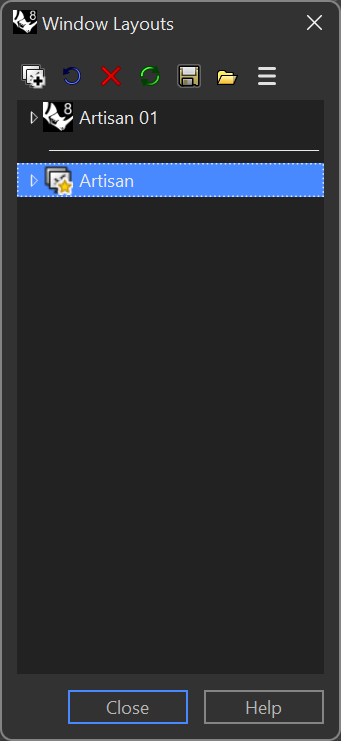

# How to restore the user interface layout?

RhinoArtisan's user interface is fully configurable, allowing you to adapt it to your taste. If, for some reason, you want to return to the original installation state, you must follow the steps below:

1. Type in the command line: **WindowLayout**, and press enter.

<figure><figcaption></figcaption></figure>

The Window Layout window will appear. Then, double-click in Artisan, restoring us to its original layout.
